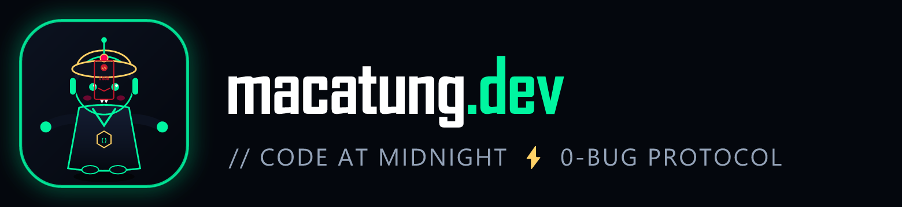

<div align="center">

# 🌙 macatung.dev — Code at midnight

**Portfolio Full-Stack & Hệ Thống Quản Trị CMS Độc Bản Của Ma Cà Tưng**

[](https://laravel.com)
[](https://inertiajs.com)
[](https://vuejs.org)
[](https://www.typescriptlang.org)
[](https://tailwindcss.com)
[](https://sqlite.org)

<p align="center">
  
</p>

</div>

---

## 📖 Giới Thiệu (About)

**macatung.dev** là không gian số (digital sanctuary) và portfolio cá nhân của **Ma Cà Tưng** — Lead Systems Architect & Creative Full-Stack Engineer. Website được xây dựng trên nền tảng **Laravel 11 + Inertia.js (Vue 3 Composition API) + SQLite**, sở hữu phong cách thiết kế **Obsidian Carbon Dark (`#04070d`)** ma mị, điểm xuyết ánh sáng **Neon Mint (`#00f5a0`)** và vàng bùa chú **Talisman Gold (`#ffd166`)**.

Hệ thống tích hợp trọn vẹn khu vực **Admin CMS Quản Trị Đa Phân Hệ** và **Hệ Thống Phân Tích Lưu Lượng Tự Thân (Self-Hosted Traffic Analytics)** bảo vệ quyền riêng tư.

---

## ✨ Điểm Nổi Bật & Tính Năng (Key Features)

### 🎨 1. Giao Diện Người Dùng Tương Tác (Frontend Sorcery)
- 🧛‍♂️ **Linh Vật Ma Cà Tưng Có Vật Lý (Hopping Mascot)**: Chú cương thi công nghệ nhảy tưng tưng theo nhịp điệu với hiệu ứng squash-and-stretch, đổi 4 trạng thái cảm xúc (`Normal`, `Caffeine Overdrive`, `Sleepy`, `Deploy Rage`) và âm thanh Web Audio chân thực.
- 🎵 **Bộ Tổng Hợp Âm Thanh Web Audio API**: Tự động phát âm thanh gõ phím, chuông thỉnh bùa, nhảy lò xo bằng procedural synthesis (0 KB file âm thanh ngoài).
- 📜 **Lò Thỉnh Bùa Lập Trình (Talisman Forge & CLI)**: Khách truy cập tự tạo bùa chú 0-bug cho riêng mình, đóng dấu ấn Khai Quang chu sa đỏ và xuất mã ASCII / SVG.
- 💻 **Midnight Terminal REPL**: Trình giả lập dòng lệnh terminal với 11 câu lệnh ma thuật (`help`, `whoami`, `cv`, `projects`, `skills`, `hop`, `coffee`, `talisman`, `sudo rm -rf bugs`).
- 🏰 **6 Dự Án Kỹ Thuật Thực Chiến (Grimoire Showcase)**: Trưng bày các sản phẩm có giá trị kinh doanh thực tế (FlashPay Checkout, DevGrimoire Vault, Midnight Audio FX, SaaS Pulse, Talisman CLI, NightOwl AI Bot).

---

### 🎛️ 2. Hệ Thống Quản Trị Nội Dung Đa Phân Hệ (Portfolio CMS — `/admin`)
- 🛡️ **Admin Login Shield (`/admin/login`)**: Bảo mật bằng Mật khẩu Quản trị viên, lưu phiên Session an toàn.
- 📐 **Giao Diện 100vh Full-Width Hiện Đại**: Thiết kế tràn viền 100%, thanh Menu trái cố định đứng yên có thể **Thu gọn / Mở rộng (Collapsible Sidebar)** và ghi nhớ trạng thái vào `localStorage`.
- 📁 **Quản Lý Dự Án (Projects CMS)**: Thêm, sửa, xóa, gắn tags, metrics và bật/tắt cờ Featured tức thì.
- ⚡ **Kỹ Năng & Pháp Bảo (Skills CMS)**: Quản lý 4 nhóm công nghệ, thanh trượt % độ thành thạo và icon Rune emoji.
- ⏳ **Biên Niên Sử (Career Chronicles CMS)**: Quản lý timeline cột mốc thời gian, công ty và danh sách thành tựu kỹ thuật.
- 📝 **Ghi Chú & Bài Viết (Midnight Tech Notes CMS)**: Soạn thảo bài viết chia sẻ kỹ thuật chuẩn định dạng Markdown.
- ⚙️ **Cài Đặt Hệ Thống (Site Settings CMS)**: Tùy chỉnh trực tiếp Slogan, Bio, Hotline Telegram, link GitHub, link tải CV và đổi mật khẩu Admin.
- 📬 **Hộp Thư Triệu Hồi (Contacts Inbox)**: Quản lý và phản hồi trực tiếp các yêu cầu dự án gửi từ Bàn Thờ Triệu Hồi.

---

### 📊 3. Theo Dõi Lưu Lượng Tự Thân (Self-Hosted Traffic Analytics)
- 🔒 **Privacy-First Middleware Tracking**: Tự động ghi nhận lượt xem (Pageviews), khách độc bản (Unique Sessions), thiết bị (Desktop / Mobile / Tablet), trình duyệt và nguồn giới thiệu (Referrer).
- 🌙 **24-Hour Midnight Heatmap**: Phân tích tỷ lệ khách truy cập khung giờ đêm (00:00 - 05:00 AM) so với ban ngày.
- 🎯 **Interaction Event Beacon**: Ghi nhận số lượt nhảy linh vật, lượt tải CV, lượt gõ lệnh CLI và số lần thỉnh bùa.
- 📈 **Biểu Đồ Trực Quan Tương Tác**: Line Chart 7 ngày, biểu đồ cột 24 giờ và bảng nhật ký Live Feed thời gian thực.

---

## 🛠️ Kiến Trúc Công Nghệ (Tech Stack)

| Thành Phần | Công Nghệ Sử Dụng |
| :--- | :--- |
| **Backend Framework** | Laravel 11.x (PHP 8.2+) |
| **Frontend Adapter** | Inertia.js (Vue 3 Adapter) |
| **Frontend Framework** | Vue 3.5+ (Composition API `<script setup lang="ts">`) |
| **Ngôn Ngữ** | TypeScript Strict Mode & PHP 8.2+ |
| **Styling & CSS** | TailwindCSS 3.4, Glassmorphism, CSS Animations |
| **Cơ Sở Dữ Liệu** | SQLite 3 (Hoặc MySQL / PostgreSQL) |
| **Âm Thanh & Đồ Họa** | Web Audio API, Canvas 2D Physics, Canvas Confetti |
| **Kiểm Thử** | PHPUnit (63 tests / 1,241 assertions), Unified E2E Runner (466 tests) |

---

## 🐳 Chạy Nhanh Bằng Docker (Khuyến Nghị / 1 Lệnh Duy Nhất)

Dự án đã được đóng gói sẵn **Multi-stage Docker** tích hợp **PHP 8.2-FPM + Nginx + Node 20 (Vite Build) + SQLite + Supervisord** với cơ chế tự động sinh key, migrate database và tối ưu hóa hiệu năng.

```bash
# 1. Khởi động ứng dụng ngay lập tức (Chạy nền)
docker compose up -d --build

# Hoặc dùng npm script
npm run docker:up
```

- 🌐 **Trang chủ Portfolio**: [`http://localhost:8000/`](http://localhost:8000/)
- 🛡️ **Khu vực Admin CMS**: [`http://localhost:8000/admin`](http://localhost:8000/admin) *(Mật khẩu mặc định: `macatung@midnight2026`)*
- 💚 **Kiểm tra trạng thái Container**: `docker compose ps`
- 📋 **Xem Logs thời gian thực**: `npm run docker:logs` *(hoặc `docker compose logs -f`)*
- 🛑 **Dừng Container**: `npm run docker:down` *(hoặc `docker compose down`)*
- ⚡ **Chạy lệnh Artisan bên trong Container**:
  ```bash
  npm run docker:artisan -- migrate:status
  npm run docker:artisan -- test
  ```

---

## 💻 Hướng Dẫn Cài Đặt & Chạy Local Không Dùng Docker

### 1. Cài Đặt Dependencies
```bash
# Cài đặt PHP Composer dependencies
composer install

# Cài đặt Node.js dependencies
npm install
```

### 2. Cấu Hình Môi Trường (.env)
```bash
cp .env.example .env
php artisan key:generate
```

### 3. Chạy Migration & Khởi Tạo Dữ Liệu
```bash
php artisan migrate --seed
```

### 4. Chạy Ứng Dụng
```bash
# Khởi động Laravel Local Server
php artisan serve

# Ở một terminal khác, chạy Vite Dev Server
npm run dev
```

- 🌐 **Trang chủ Portfolio**: `http://127.0.0.1:8000/`
- 🛡️ **Khu vực Admin CMS**: `http://127.0.0.1:8000/admin`
  - *Mật khẩu đăng nhập mặc định*: `macatung@midnight2026`

---

## 🧪 Chạy Kiểm Thử (Testing)

```bash
# Chạy toàn bộ 63 PHPUnit Feature Tests
php artisan test

# Chạy toàn bộ 466 Unified E2E Frontend Tests
node tests/run_all_tests.js
```

---

## 📦 Bản Quyền & Tác Giả

- **Tác giả**: **Ma Cà Tưng** ([macatung.dev](https://macatung.dev))
- **Slogan**: *"Code at midnight"* 🌙
- **Giấy phép**: MIT License
